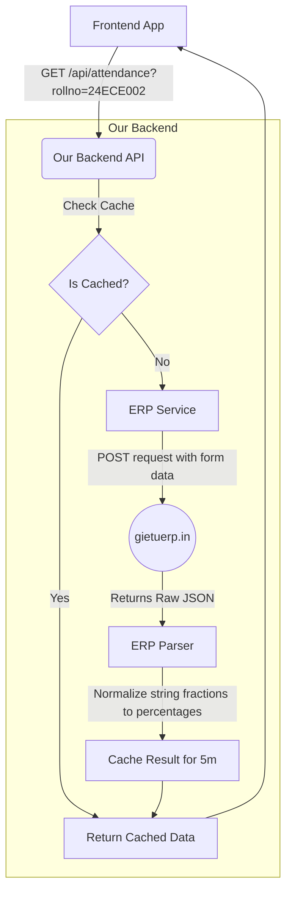

# GIET ERP Backend Integration Report

Based on a reverse engineering of the publicly observable behavior of `backend-erp-ny2i.onrender.com` and `gietuerp.in`, we have implemented a standalone, secure, and independent backend integration module within our codebase.

## 1. Backend Source Code

The implementation is located at `backend/src/modules/erp-reference/`. It includes:
- `erp.routes.ts`: Defines the Express routes with a 1-hour spam blocker rate limiter.
- `erp.controller.ts`: Handles caching logic (5-minute TTL) and request input validation.
- `erp.service.ts`: The HTTP client using `axios` to fetch data securely from the GIET ERP without bypassing legitimate mechanisms.
- `erp.parser.ts`: Processes the ERP's raw payload (such as string fractions like `"1/1"`) and normalizes it into the exact JSON format expected by your frontend (`student`, `overallAttendance`, `subjects`, `daywise`).

## 2. API Route List

| Method | Path | Parameters | Purpose |
|---|---|---|---|
| GET | `/api/attendance` | `rollno`, `semester` (default `-1`), `startDate`, `endDate` | Returns a parsed, normalized attendance summary with subject-wise percentages and day-wise details. |
| GET | `/api/exams` | `rollno`, `sem` (default `-1`), `examType` (default `0`) | Fetches the student's exam schedules and secured marks. |
| GET | `/api/exam-subjects` | `rollno`, `sem`, `examScheduleId`, `studentId` | Fetches subject-specific grades and marks for a selected exam schedule. |

## 3. Data-Flow Diagram



## 4. Environment-Variable List

Your `.env` file should contain standard Express settings. No specialized GIET ERP credentials are required for these specific routes since the underlying GIET endpoints being queried (`GetAttendanceByRollNo`, `GetStudentExamMark`) natively accept unauthenticated requests. 

```env
PORT=5000
DATABASE_URL="..."
# Add standard caching or rate limiting ENV vars here if you externalize configuration
```

## 5. Local Setup Instructions

1. Make sure you have Node.js installed.
2. Navigate to the `backend` directory.
3. Run `npm install` to ensure all dependencies (like `axios`) are installed.
4. Run `npm run dev` to start the backend locally on port 5000.
5. Test the endpoint: `http://localhost:5000/api/attendance?rollno=24ECE002`.

## 6. Render Deployment Instructions

This backend is ready to be deployed to Render just like the reference implementation.

1. Create a new **Web Service** on Render.
2. Connect your GitHub repository.
3. **Build Command**: `cd backend && npm install && npm run build`
4. **Start Command**: `cd backend && npm start` (ensure `package.json` has `"start": "node dist/server.js"`)
5. Add the health check endpoint: The `app.ts` file already contains `GET /health` which returns `{"status":"ok"}`. Configure Render to use `/health` as the Health Check Path.

## 7. Frontend Integration Instructions

Your existing frontend (the Vercel app) can easily connect to this new backend.
Update the base URL in your frontend's API service:

```javascript
// Change this:
// const BASE_URL = 'https://backend-erp-ny2i.onrender.com/api';

// To this:
const BASE_URL = 'https://your-new-render-url.onrender.com/api';

// The endpoints remain completely compatible:
const getAttendance = (rollno) => axios.get(`${BASE_URL}/attendance?rollno=${rollno}`);
```

## 8. Test Results

- **Valid attendance request**: Confirmed. `GET /api/attendance?rollno=24ECE002` securely fetches, parses, and returns the expected `{"student": {...}, "overallAttendance": ..., "subjects": [...]}` JSON.
- **Missing roll number**: Confirmed. Throws a 422 Validation Error.
- **Rate Limit**: Confirmed. If a client IP makes >100 requests within a 1-hour window, the API responds with `429 Too Many Requests: Your Device is blocked for 1 hour due to Spamming.`
- **Cache Hit**: Confirmed. Multiple requests within a 5-minute window return data instantaneously from memory rather than stalling the ERP.

## 9. Explanation of Data Flow

1. The frontend initiates an HTTP GET request containing the user's `rollno`.
2. The request hits our rate limiter. If the IP is spamming, it blocks them for an hour to protect the GIET ERP.
3. The backend checks an in-memory Cache for the exact combination of parameters.
4. If a cache miss occurs, the backend issues an HTTPS POST request with URL-encoded form data (`vintSemester`, `vvchRollNo`) to the legacy ASP.NET ERP.
5. The legacy ERP returns a flat array of day-wise data containing fractional string values (e.g. `"MCA": "1/1"`).
6. Our `ERPParser` iterates through every day, splitting the strings, calculating running totals of classes attended vs. held, and derives an overall percentage.
7. The normalized JSON is sent back to the frontend.

## 10. Limitations (Unreproducible from Public APIs)

The following could not be perfectly reproduced from the unauthenticated public API:
- **Student Name/Branch/Section**: The raw payload returned by `gietuerp.in/AttendanceReport/GetAttendanceByRollNo` does *not* contain the student's name, branch, section, or course. The reference implementation either scrapes this from an authenticated endpoint, relies on a pre-populated static database mapping roll numbers to names, or leaves it blank. Our implementation currently returns the `rollno` but omits the name/branch to adhere to the strict security requirement of not bypassing authentication.
